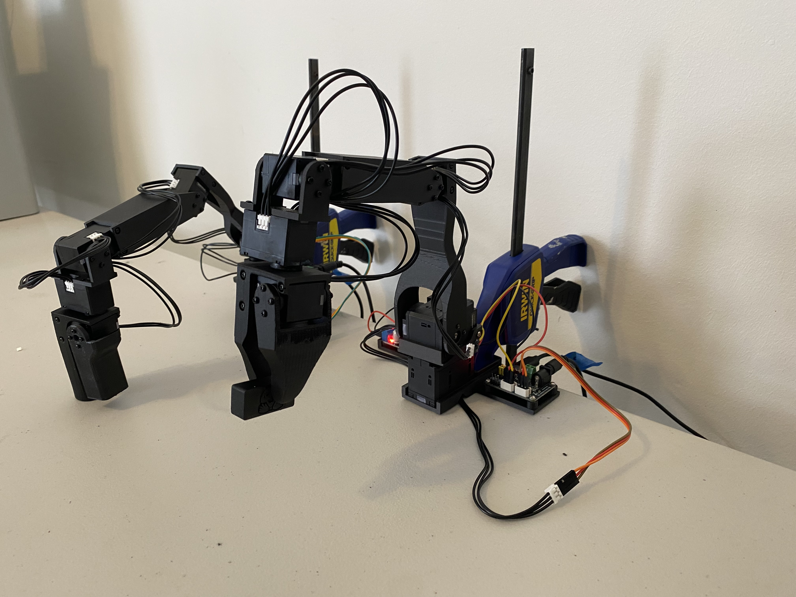
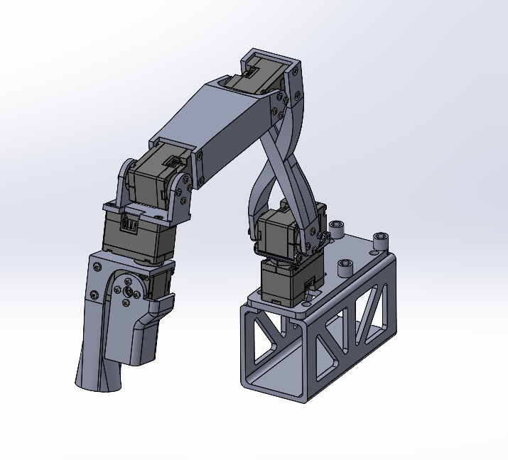
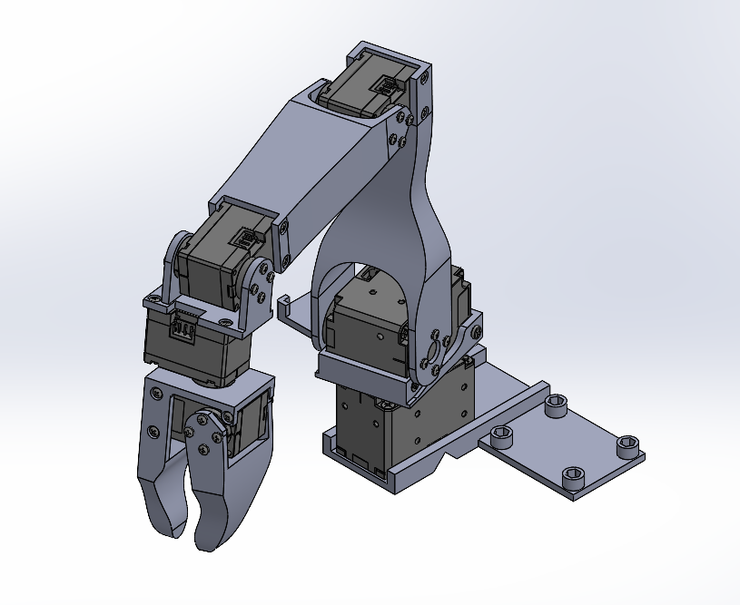
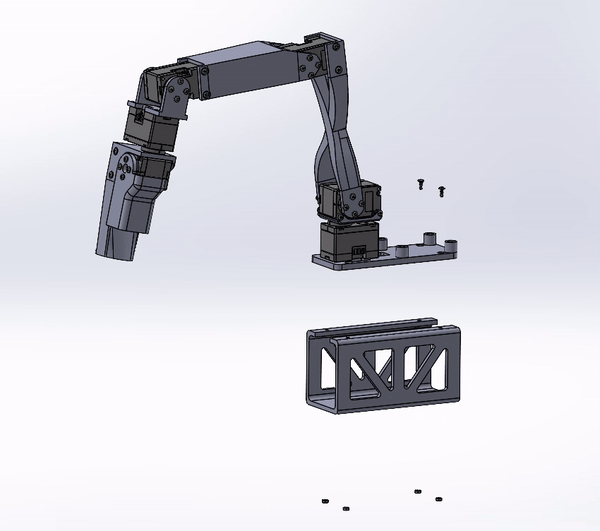

# Low-Cost Robot Arm: Koch v1.1

This page contains the instructions to build a low-cost robot arm. It's an improved version of the original [Alexander Koch's robot](https://github.com/AlexanderKoch-Koch/low_cost_robot) to ease assembly. Thus, we call it Koch v1.1

For the curious reader, here are the most significant changes made:
1. Made small improvements to the hardware model including but not limited to: fixed screw interferences, cleaned up extraneous material, standardized hole sizes, removed screws fastening into plastic, added board platform to leader robot.
2. Added a platform for the leader arm. While not strictly necessary, this platform allows the follower arm to pick objects off the ground which it could not do in the previous configuration.
3. Removed the need for a soldering iron to assemble and for manually adjusting the voltage convertor, by replacing the DC convertor.
4. Added SolidWorks models to make it easier for the community to contribute.
5. Added a wiring diagram.
6. Added assembly video for leader and follower arm with SW animations.

## Assembly Instructions

### Sourcing Parts
Order the off the shelf parts for the leader and follower arm using the links below. Note prices and items may vary slightly depending on geographic location.

#### Leader Arm

/!\ Warning: We only have links for US, EU, UK for now. If you find links for other countries like China or India, please create an issue or PR so that we add them to the list.

| Part | Amount | Unit Cost (US) | Buy US | Unit Cost (EU) | Buy EU | Unit Cost (UK) | Buy UK |
|---|---|---|---|---|---|---|---|
| Dynamixel XL330-M077-T | 6 | $24 | [Robotis](https://www.robotis.us/dynamixel-xl330-m077-t) | 40€ | [MyBotShop](https://www.mybotshop.de/DYNAMIXEL-XL330-M077-T)-[GenRobots](https://www.generationrobots.com/en/403818-dynamixel-xl330-m077-t-servo-motor.html) | £27 | [RoboSavvy](https://robosavvy.co.uk/robotis-dynamixel-xl330-m077-t.html) |
| XL330 Frame and Idler Wheel 4pcs set[1](#myfootnote1) | 1 | $10 | [Robotis](https://www.robotis.us/fpx330-h101-4pcs-set) | 12€ | [GenRobots](https://www.generationrobots.com/en/403860-FPX330-H101-hinge-frame-and-idler-set-dynamixel-xl330.html) | £10 |  [RoboSavvy](https://robosavvy.co.uk/fpx330-h101-4pcs-set.html) |
| Waveshare Serial Bus Servo Driver Board | 1 | $10 | [Amazon](https://a.co/d/7C3RUYU) | 6€ | [GenRobots](https://eckstein-shop.de/WaveShare-Serial-Bus-Servo-Driver-Board-for-ST-SC-Serial-Bus-Servos-EN) | £11 | [Amazon](https://www.amazon.co.uk/Waveshare-Integrates-Control-Applicable-Integrate/dp/B0CJ6TP3TP/) |
| 5V Power Supply | 1 | $6 | [Amazon](https://a.co/d/5u90NVp) | 9€ | [Amazon](https://www.amazon.fr/LEYF-Alimentation-Universelle-Adaptateur-Enfichable/dp/B09NGVWBSY) | £10 | [Amazon](https://www.amazon.co.uk/Adapter-Switching-100-240V-5-5x2-1mm-Transformer-5V2A-UKCA/dp/B0CH6HFVTK/)|
| Jumper Wires 3*40 pcs set (M-M, M-F, F-F) | 1 | $7 | [Amazon](https://a.co/d/hQfk2cb) | 9€ | [Amazon](https://www.amazon.fr/AZDelivery-Jumper-Cavalier-C%C3%A2ble-Arduino/dp/B074P726ZR) | £7 | [Amazon](https://www.amazon.co.uk/Elegoo-120pcs-Multicolored-Breadboard-arduino-colorful/dp/B01EV70C78/)|
| Table Clamp | 1 | $6 | [Amazon](https://a.co/d/4KEiYdV) | n/a | n/a | n/a | n/a |
| Table Clamp 4pcs set[2](#myfootnote2) | 1 | n/a | n/a | 14€ | [Amazon](https://www.amazon.fr/CAUTIOUS-Serre-Joint-R%C3%A9glable-Serre-Joints/dp/B0CJMB3SKH) | £17 | [Amazon](https://www.amazon.co.uk/CAUTIOUS-Stainless-Performance-Clamps-Woodworking/dp/B0CJMB3SKH/) |
| 1.5mm Star/Cruciform Screwdriver 2pcs set | 1 |  $7 | [Amazon](https://www.amazon.com/uxcell-Precision-Screwdriver-Eyeglasses-Electronics/dp/B0BLLV52G8/)| 7€ | [Amazon](https://www.amazon.fr/sourcing-map-Cruciforme-%C3%89lectroniques-R%C3%A9paration/dp/B0BQ69J2QF) | £4 | [Amazon](https://www.amazon.co.uk/sourcing-map-Screwdriver-Eyeglasses-Electronics/dp/B0BLM2Y2Z5/) |
| USB C-A or C-C 2pcs set[3](#myfootnote3) | 1 | $9 | [Amazon](https://www.amazon.com/Charging-etguuds-Charger-Braided-Compatible/dp/B0B8NWLLW2/) | 7€ | [Amazon](https://www.amazon.fr/-/en/dp/B0CKPDZ3SK/) | £6 | [Amazon](https://www.amazon.co.uk/Anker-Charger-Braided-Standard-Charging/dp/B07DD5YHMH/)|
| Total | | $199 | | 304€ | | £227 | |

#### Follower Arm

/!\ Warning: We only have links for US, EU, UK for now. If you find links for other countries like China or India, please create an issue or PR so that we add them to the list.

| Part | Amount | Unit Cost (US) | Buy US | Unit Cost (EU) | Buy EU | Unit Cost (UK) | Buy UK |
|---|---|---|---|---|---|---|---|
| Dynamixel XL430-W250-T |  2 | $50 | [Robotis](https://www.robotis.us/dynamixel-xl430-w250-t) | 57-61€ | [MyBotShop](https://www.mybotshop.de/DYNAMIXEL-XL430-W250-T)-[GenRobots](https://www.generationrobots.com/en/402823-dynamixel-xl430-w250-t-servomotor.html) | £47 | [RoboSavvy](https://robosavvy.co.uk/dynamixel-xl430-w250-t.html)
| Dynamixel XL330-M288-T |  4 | $24  | [Robotis](https://www.robotis.us/dynamixel-xl330-m288-t) | 40-46€ | [MyBotShop](https://www.mybotshop.de/DYNAMIXEL-XL330-M288-T)-[GenRobots](https://www.generationrobots.com/en/403817-dynamixel-xl330-m288-t-servo-motor.html) | £27 | [RoboSavvy](https://robosavvy.co.uk/robotis-dynamixel-xl330-m288-t.html) |
| XL330 Frame and Idler Wheel 4pcs set[1](#myfootnote1) |  1 | $10 | [Robotis](https://www.robotis.us/fpx330-h101-4pcs-set) | 12€ | [GenRobots](https://www.generationrobots.com/en/403860-FPX330-H101-hinge-frame-and-idler-set-dynamixel-xl330.html) | £10 |  [RoboSavvy](https://robosavvy.co.uk/fpx330-h101-4pcs-set.html) |
| XL430 Idler Wheel set | 1 | $7 | [Robotis](https://www.robotis.us/hn11-i101-set) | 9€ | [GenRobots](https://www.generationrobots.com/en/403206-hn11-i101-horn-set.html) | £7 | [Robosavvy](https://robosavvy.co.uk/hn11-i101-set.html)|
| Waveshare Serial Bus Servo Driver Board | 1 | $10 | [Amazon](https://a.co/d/7C3RUYU) | 6€ | [Eckstein](https://eckstein-shop.de/WaveShare-Serial-Bus-Servo-Driver-Board-for-ST-SC-Serial-Bus-Servos-EN) | £11 | [Amazon](https://www.amazon.co.uk/Waveshare-Integrates-Control-Applicable-Integrate/dp/B0CJ6TP3TP/)|
| Voltage Reducer | 1 | $14 | [Amazon](https://www.amazon.com/EPLZON-Converter-5V-5-3V-Transformer-Regulator/dp/B09R4DBZJK) | 7€ | [Amazon](https://www.amazon.fr/ICQUANZX-Converter-Transformer-Voltage-Regulator/dp/B07RGB2HB6) | £15 | [Amazon](https://www.amazon.co.uk/Converter-Voltage-Regulator-Transformer-Charging/dp/B0989DKYWN) |
| 12V Power Supply | 1 | $12 | [Amazon](https://a.co/d/40o8uMN) | 15-36€ | [Amazon](https://www.amazon.fr/LEDMO-Alimentation-Adaptateur-Transformateurs-Chargeur/dp/B07PGLXK4X)-[GenRobots](https://www.generationrobots.com/en/400866-smps-charger-for-bioloid-and-dynamixel-robotis.html) | £13 | [Amazon](https://www.amazon.co.uk/Facmogu-Adapter-100-240V-Monitors-Amplifier/dp/B0CXPMJJMF/) |
| Jumper Wires 3*40 pcs set (M-M, M-F, F-F) | 1 | $7 | [Amazon](https://a.co/d/hQfk2cb) | 9€ | [Amazon](https://www.amazon.fr/AZDelivery-Jumper-Cavalier-C%C3%A2ble-Arduino/dp/B074P726ZR) | £7 | [Amazon](https://www.amazon.co.uk/Elegoo-120pcs-Multicolored-Breadboard-arduino-colorful/dp/B01EV70C78/)|
| Table Clamp | 1 | $6 | [Amazon](https://a.co/d/4KEiYdV) | n/a | n/a | n/a | n/a |
| Table Clamp 4pcs set[4](#myfootnote4) | 1 | n/a | n/a | 14€ | [Amazon](https://www.amazon.fr/CAUTIOUS-Serre-Joint-R%C3%A9glable-Serre-Joints/dp/B0CJMB3SKH) | £17 | [Amazon](https://www.amazon.co.uk/CAUTIOUS-Stainless-Performance-Clamps-Woodworking/dp/B0CJMB3SKH/) |
| 1.5mm Star/Cruciform Screwdriver 2pcs set[5](#myfootnote5) | 1 |  $7 | [Amazon](https://www.amazon.com/uxcell-Precision-Screwdriver-Eyeglasses-Electronics/dp/B0BLLV52G8/)| 7€ | [Amazon](https://www.amazon.fr/sourcing-map-Cruciforme-%C3%89lectroniques-R%C3%A9paration/dp/B0BQ69J2QF) | £4 | [Amazon](https://www.amazon.co.uk/sourcing-map-Screwdriver-Eyeglasses-Electronics/dp/B0BLM2Y2Z5/) |
| USB C-A or C-C 2pcs set[6](#myfootnote6) | 1 | $9 | [Amazon](https://www.amazon.com/Charging-etguuds-Charger-Braided-Compatible/dp/B0B8NWLLW2/) | 7€ | [Amazon](https://www.amazon.fr/-/en/dp/B0CKPDZ3SK/) | £6 | [Amazon](https://www.amazon.co.uk/Anker-Charger-Braided-Standard-Charging/dp/B07DD5YHMH/)|
| Total | | $278 | | 360€ | | £290 | |

### Printing the Parts
A variety of 3D printers are acceptable to print the parts necessary of the follower and leader arm. Follow the steps below to ensure a good print.

1. Choose a printer: When choosing a printer there are a variety of factors to consider. Below are the suggested printed settings, although using a printer outside these parameters may likely work as well.
   1. Precision: 0.2mm minimum height layer[7](#myfootnote7)
   2. Material: PLA+, ABS, PETG or other reasonably strong plastics.
   3. Nozzle Diameter: 0.4mm maximum nozzle diameter
   4. Infill Density: ~30% [8](#myfootnote8)
   5. Sample Printers: [Prusa Mini+](https://www.prusa3d.com/product/original-prusa-mini-semi-assembled-3d-printer-4/), [Bambu P1](https://us.store.bambulab.com/collections/p1-series/products/p1p), [Ender3](https://www.amazon.com/Comgrow-Creality-Ender-Aluminum-220x220x250mm/dp/B07BR3F9N6/), etc.  
2. Set up the printer
   1. Materials:[9](#myfootnote9)
      1. [Standard Glue Stick](https://www.amazon.com/Amazon-Basics-Washable-School-Sticks/dp/B0CRCWCGNW/)
      2. [Putty Knife](https://www.amazon.com/Warner-ProGrip-Putty-Knife-90133/dp/B000I1VEK6/)
   2. Setup and Takedown
      1. Ensure that the printer is calibrated and the bed level is correctly set using the printer specific instructions.
      2. Clean the print bed, making sure it is free from dust, or grease. If cleaning the bed using water, or other liquid, dry the bed.
      3. Use a standard glue stick and apply a thin, even layer of glue across the print area of the bed. Avoid clumping or uneven application.
      4. Load the printer filament using printer specific instructions.
      5. Ensure the printer settings match the ones suggested above (most printers have multiple settings so choose the ones that most closely match).
      6. Check file type, choose the file(s) from the hardware folder and print.[10](#myfootnote10)
3. Print one of each of parts found in `hardware/leader/STL` and `hardware/follower/STL`, which are listed below.
   1. Leader:
      1. Leader_Base
      2. Leader_Elbow_To_Wrist
      3. Leader_Elbow_To_Wrist_Extension
      4. Leader_Gripper_Handle
      5. Leader_Gripper_Trigger
      6. Leader_Shoulder_To_Elbow
      7. Leader_Platform[11](#myfootnote11)
      8. Robotis_FPX330_S101[12](#myfootnote12)
   2. Follower:
      1. Follower_Base
      2. Follower_Elbow_To_Wrist
      3. Follower_Elbow_To_Wrist_Extension
      4. Follower_Gripper_Moving_Part
      5. Follower_Gripper_Static_Part
      6. Follower_Shoulder_Rotation
      7. Follower_Shoulder_To_Elbow
   3. Optional Parts:[13](#myfootnote13)
      1. HuggingFace_Block
      2. LeRobot_Block
4. Take Down
   1. After the print is done, use the putty knife to scrape the the parts off the print bed.
   2. Remove any support material from parts.
   3. Reapply the glue stick before starting the next print.

### Assembling the Parts
Construct the leader and follower arms using the Assembly Video linked below. After you assemble the two arms from the video, power the leader arm using the 5V power supply[14](#myfootnote14), and the follower arm using the 12V power supply. In addition, plug each arm into your computer using a USB-C cable.

Video of the Assembly: [Youtube](https://www.youtube.com/watch?v=8nQIg9BwwTk)

Note: The Leader Platform has been altered to be fastened instead of snapping into place, as the latter design was not creating a tight fit for certain printers. In time, this will be fixed in the video link above, but for now follow the below directions. 

Insert the nuts into the pockets on the underside of the Leader Platform. Then, use the M2x5 machine screws to fasten the Leader_Platform to the Leader_Base. You will need to temporarily remove the Waveshare Serial Bus Servo Driver Board to access the two fasteners beneath it.

Parts:
1. Leader_Platform
2. Four M2x5 Machine Screws
3. Four M2 Nuts

### Configure
While this robot can be programmed in a variety of manners, it is suggested to use with [LeRobot](https://github.com/huggingface/lerobot/blob/main/examples/7_get_started_with_real_robot.md).

### Footnotes
<a name="myfootnote1">1</a>: You will only use three idler wheels that come in this four piece set.\
<a name="myfootnote2">2</a>: You will only need one clamp in this four piece set.\
<a name="myfootnote3">3</a>: You will only need one chord in this two piece set. \
<a name="myfootnote4">4</a>: If you bought the 4 piece clamp set for the leader arm, you will not need to buy it again here, as only one clamp is necessary of the follower arm, and one for the leader arm.\
<a name="myfootnote5">5</a>: If you bought the screwdriver set for the leader arm, you will not need to buy it again here as the same screwdriver is used for the follower and leader arm.\
<a name="myfootnote6">6</a>: If you bought the two piece cable set for the leader arm, you will not need to buy it again here, as only one cable is necessary for the leader arm, and one for the follower arm. \
<a name="myfootnote7">7</a>: This precision is based on the fact the through holes for M2 fasteners are 2.4mm in diameter while the nominal diameter of a M2 fastener is 2mm. In a worst case scenario, this allows +/- 0.2mm while still allowing for screw alignment. However, if you are only capable of printing with a larger layer height, you will likely be fine, just ensure the screw holes align as expected.\
<a name="myfootnote8">8</a>: It is quite possible a lower density infill could be used, however, erring on the side of caution, I used 37% to ensure strong parts.  \
<a name="myfootnote9">9</a>: You do not need to buy these exact parts, but a glue stick and putty knife are almost always necessary for a good 3D print. The glue prevents parts from sticking to the print bed, and the putty knife helps scrape parts from the print bed. However, feel free to check with your specific printer instructions for if these parts are necessary. \
<a name="myfootnote10">10</a>: All the printers suggested will print STL files. However, if your printer only prints a different format, ensure you convert the file to the correct extension before printing. \
<a name="myfootnote11">11</a>: This is not strictly necessary to print but does allow the follower arm to reach the ground which is is otherwise unable to do in the current setup. \
<a name="myfootnote12">12</a>: You can either buy the Robotis [FPX330-S101](https://www.robotis.us/fpx330-s101-4pcs-set/), or 3D print it, but it is cheaper to print. \
<a name="myfootnote13">13</a>: Two blocks each the same size as a 2x4 Lego block, not necessary to print, but useful as a starting manipuland. \
<a name="myfootnote14">14</a>: The observant technician may realize the Serial Bus Servo Driver Board suggests an input DC voltage between 9 to 12.6V, where for the leader arm we are only applying 5V. This lower voltage will not hurt the board, and must be done to correctly power the servos on the leader arm.
